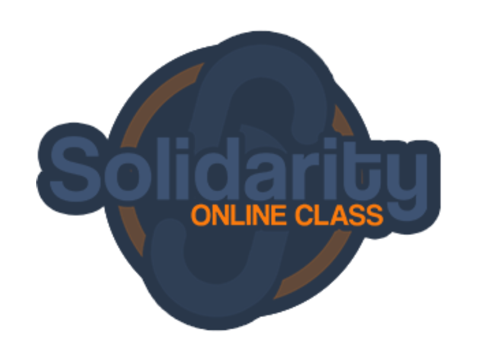
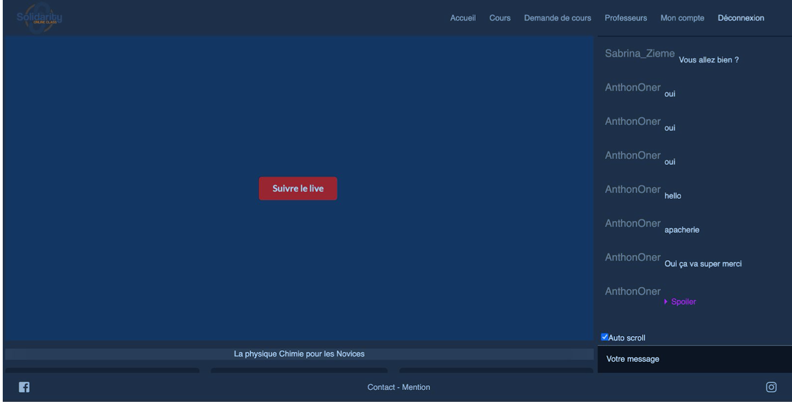

<h1 align="center">solidarity</h1>

<div align="center">
   Interactive class room with chat, webcam, micro and screen share
</div>

<!-- <div align="center">
  <h3>
    <a href="https://{your-demo-link.your-domain}">
      Demo
    </a>
    <span> | </span>
    <a href="https://{your-url-to-the-solution}">
      Solution
    </a>
    <span> | </span>
    <a href="https://devchallenges.io/challenges/rleoQc34THclWx1cFFKH">
      Challenge
    </a>
  </h3>
</div> -->

<!-- TABLE OF CONTENTS -->

## Table of Contents

- [Overview](#overview)
  - [Built With](#built-with)
- [Features](#features)
- [How to use](#how-to-use)
- [Contact](#contact)
- [Acknowledgements](#acknowledgements)

<!-- OVERVIEW -->

## Overview




### Built With
This section should list any major frameworks that you built your project using. Leave any add-ons/plugins for the acknowledgements section. Here are a few examples.
* [Node](https://nodejs.org/dist/latest-v12.x/docs/api/)
* [Express](https://nodejs.org/dist/latest-v12.x/docs/api/)
* [React](https://fr.reactjs.org/)
* [Redux](https://redux.js.org/)
* [Postgres](https://redux.js.org/)
* [Sqitch](https://redux.js.org/)
* [Semanthic UI](https://material-ui.com/)


<!-- GETTING STARTED -->
## Getting Started

### Prerequisites

This is an example of how to list things you need to use the software and how to install them.
* npm
```sh
npm install npm@latest -g
```

### Installation

1. Clone the repo
```sh
git clone https://github.com/decuyperanthony/solidarity

```
2. Create your postgres db => MCD in
```
 cd /server/doc
 ```

3. Migrations
```
 cd /server/migrations
 sqitch deploy
 ```

4. To init server && Install NPM server packages && start server
```sh
cd server
cp .env.example .env
npm install
npm start
```
5. Install YARN client packages && start server
```sh
cd client
yarn
yarn start
```

## Acknowledgements

<!-- This section should list any articles or add-ons/plugins that helps you to complete the project. This is optional but it will help you in the future. For example: -->

- [Steps to replicate a design with only HTML and CSS](https://devchallenges-blogs.web.app/how-to-replicate-design/)
- [Node.js](https://nodejs.org/)
- [Marked - a markdown parser](https://github.com/chjj/marked)

## Contact

- Website [https://anthonydecuyper.netlify.app/](https://anthonydecuyper.netlify.app/)
- GitHub [@decuyperanthony](https://github.com/decuyperanthony)

